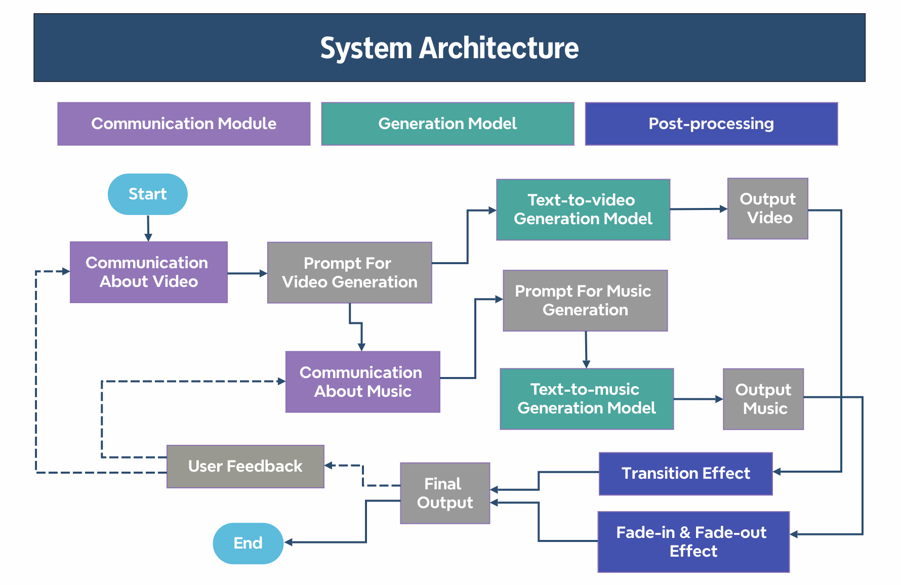

# Dream Maker: A chat-based music video generation system
<p align="center">
    
</p>

We want to develop a user-friendly system that aims to concretely show the user's imagination through a short music video based on LLMs and generation models. The figure above shows the architecture of our system.  
  
To be more precise, the user will interact with our system through a ChatGPT-based communication module, where the user can naturally express their requirements and preferences just like they are talking to a video producer. After getting sufficient information from communicating with the user, the ChatGPT will generate prompts to guide video and music generation. Several videos and music will be generated by a text-to-video model (currently, we use [AnimateDiff](https://github.com/guoyww/AnimateDiff)) and a text-to-music model (currently, we use [MusicGen](https://github.com/facebookresearch/audiocraft/blob/main/docs/MUSICGEN.md) and [MAGNeT](https://github.com/facebookresearch/audiocraft/blob/main/docs/MAGNET.md) in AudioCraft).  After the post-processing, the video and the background will be combined into the final output.

## Get started
### Install Animatediff
- Create a virtual environment which named as "animatediff" following the instructions in the official repository of [AnimateDiff](https://github.com/guoyww/AnimateDiff).

### Install audiocraft
- Create a virtual environment which named as "audiocraft" following the instructions in the official repository of [audiocraft](https://github.com/facebookresearch/audiocraft).  
- Copy and paste the "[dream_maker](https://github.com/Ust-Waylon/Dream_Maker/tree/main/dream_maker)" folder into the folder of audiocraft.

### Install dependencies for Dream Maker
```bash
#install the dependencies into the virtual env for animatediff
conda activate animatediff 
pip install openai==0.28
pip install moviepy
pip install gradio
```
### Specify the paths
- In "communication_module/AnimateDiff/configs/prompts/RealisticVision_v2.yaml", modify the paths to motion module and dreambooth
- In "animatediff_pipeline.py", modify the *self*.pretrained_model_path to the path to the stable diffusion model folder
- In "musicgen_pipeline.py", modify the *self*.musicgen_path to where you put the dream_maker folder (in the audiocraft folder)

### Run the code
Since we need to run the video generation model and the music generation model concurrently, two different terminals are needed.
```bash
# Terminal 1
conda activate audiocraft
cd audiocraft/dream_maker
python generate.py

# Terminal 2
conda activate animatediff
cd communication_module
python Home.py
```
Then you can play with the interface on the browser by clicking the link in the terminal.
```
...
Running on local URL:  http://127.0.0.1:7860
...
```
## User guide
To be updated.

## Demo outputs
To be updated.

## Acknowledgements
Video generation model [AnimateDiff](https://github.com/guoyww/AnimateDiff).  
Music generation model [audiocraft](https://github.com/facebookresearch/audiocraft) - [MusicGen](https://github.com/facebookresearch/audiocraft/blob/main/docs/MUSICGEN.md) & [MAGNeT](https://github.com/facebookresearch/audiocraft/blob/main/docs/MAGNET.md).
